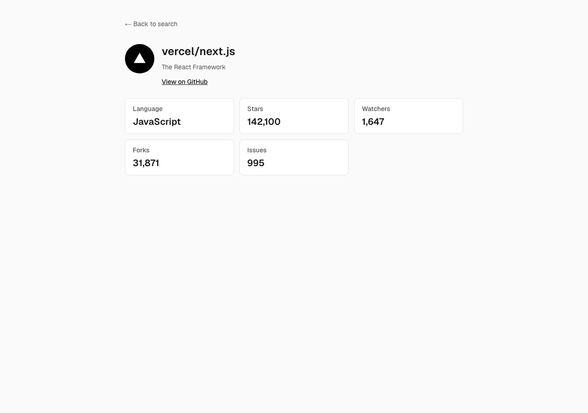

# GitHub Repository Search

[](https://github.com/okusawa/github-repository-search/actions/workflows/ci.yml)

GitHub の公開リポジトリをキーワード検索し、一覧と詳細をページとして表示する Web アプリケーションです。Next.js 16 App Router と React Server Components から GitHub REST API を呼び出します。検索条件は URL に持つので、リロード・共有・直リンクでも壊れません。

| 検索と一覧 | リポジトリ詳細 |
|---|---|
|  |  |

## 課題要件との対応

| # | 要件 | 実装 |
|---|------|------|
| E1 | Next.js v16 以降 | `next@16.3.4` |
| E2 | App Router | `src/app/` のみ |
| E3 | コンポーネントライブラリは任意 | 使わず Tailwind CSS のみ |
| R1 | キーワード入力 | 検索フォーム。`?q=` に反映 |
| R2 | `search/repositories` で一覧 | Server Component から直接呼び出し |
| R3 | 詳細に7項目 | 名前 / オーナーアイコン / 言語 / Star / Watcher / Fork / Issue |
| R4 | 詳細はページ | `/repositories/[owner]/[repo]` |
| R5 | テスト | Vitest 9 件、Playwright 2 件 |

## 起動方法

Node.js 22（`.nvmrc`）と npm が必要です。

```bash
nvm use
npm ci
cp .env.example .env.local   # 任意
npm run dev
```

http://localhost:3000

`GITHUB_TOKEN` は任意です。未設定でも動きます（Search API は 10 req/min）。トークンを置くと 30 req/min になります。public リポジトリの read だけの Fine-grained PAT で足ります。

```bash
docker build -t github-repository-search .
docker run -p 3000:3000 github-repository-search
```

トークンを使うときだけ `--env-file .env.local` を付けます。本番想定は `output: 'standalone'` のマルチステージ Dockerfile です。`docker-compose.yml` は置いていません。

| コマンド | 内容 |
|----------|------|
| `npm run lint` / `typecheck` / `test` | ESLint / `tsc` / Vitest |
| `npm run build` / `start` | 本番ビルドと起動 |
| `npm run test:e2e` | Playwright 2本。初回は `npx playwright install`。CI には含めない |

## 技術選定

| 技術 | 理由 |
|------|------|
| Next.js 16 App Router | 課題要件。`searchParams` を Server Component で受けられる |
| RSC | トークンと API 呼び出しをサーバーに閉じる |
| TypeScript（strict）+ zod | 型と、外部 API / クエリの実行時検証 |
| Tailwind CSS | この画面数なら追加の UI ライブラリは不要 |
| Vitest + MSW + Testing Library | ロジックと Client UI |
| Playwright | 通しとレート制限の E2E（2本） |

## 設計上の判断

### Watcher 数は `subscribers_count`

GitHub REST API では `watchers` / `watchers_count` / `stargazers_count` はいずれも **Star 数**です。課題が求める Watcher 数は `GET /repos/{owner}/{repo}` の **`subscribers_count`** にしかありません。

> In responses from the REST API, `watchers`, `watchers_count`, and `stargazers_count` correspond to the number of users that have starred a repository, whereas `subscribers_count` corresponds to the number of watchers.
> — https://docs.github.com/en/rest/activity/starring

そのため詳細は一覧のデータを引き回さず、単一リポジトリ API を呼びます。直リンクでも成立します。

### Issue 数は `search/issues` を Suspense で分離

`open_issues_count` は Pull Request を含みます。Issue 数は `q=repo:{owner}/{repo} type:issue state:open` の `total_count` です。区切りはスペースです（`+` を文字列に書くと `%2B` になり 422 になります）。

取得は `<Suspense>` 内の `IssueCount` に閉じます。失敗しても他の項目は残し、Issue 欄だけ「Could not retrieve」にします。

### サーバー境界。Route Handler は作らない

| `'use client'` | 理由 |
|----------------|------|
| `search-form.tsx` | `router.push` で URL を組み立てる |
| `retry-button.tsx` | `router.refresh()` |
| 各 `error.tsx` | Next.js の error boundary は Client 必須 |

`pagination.tsx` は `<Link>` だけなので Server のままです。`GITHUB_TOKEN` に `NEXT_PUBLIC_` は付けません。検索状態は URL にあるので、`app/api/**` は挟んでいません。

### 検索状態は URL

`/?q=next.js&page=2&sort=stars`。`useState` には持ちません。既定の `page=1` と `sort=best-match` は URL に載せません。

### エラー分類

| 種別 | 判定 | 表示 |
|------|------|------|
| `rate_limit` | 403 / 429 かつ `x-ratelimit-remaining: 0` | 復帰までの相対時刻 |
| `not_found` | 404 | 詳細は `not-found.tsx` |
| `invalid_query` | 422 | 条件が不正 |
| `upstream` | 5xx とその他 4xx | GitHub 側の問題 |
| `network` | `fetch` が throw | 接続失敗 |

403 は権限エラーでも返るので、ヘッダを見ます。`'use cache'` 内でクラスを throw すると error boundary に落ちるため、検索・詳細の API エラーは `kind` / `message` / `resetAt` のオブジェクトとして返します。詳細の 404 だけ `notFound()` します。

### キャッシュ

`cacheComponents: true` と、API 関数の `'use cache'` + `cacheLife('minutes')`。一覧は `<Suspense>` でストリーミングします。

## テスト戦略

| 層 | ツール | 対象 |
|----|--------|------|
| ユニット | Vitest | エラー分類、`searchParams` |
| データ層 | Vitest + MSW | `searchRepositories` のパースと zod |
| コンポーネント | Testing Library | 検索フォーム、ページネーション |
| E2E | Playwright | 検索→詳細、レート制限（2本） |

Server Component は RTL で描画していません。振る舞いは E2E、ロジックは純関数とデータ層で守ります。E2E は `GITHUB_API_BASE` でローカルモックに向けます。CI は lint / typecheck / test / build だけで、E2E は入れません。

## AI の利用方法

| 役割 | 内容 |
|------|------|
| 設計判断（人間） | 仕様を先に固め、書いていない判断を実装にさせない |
| 調査（AI + 人間） | Watcher / Issue 数 / Cache Components。公式ドキュメントで裏取り |
| 実装（AI） | 確定した仕様に沿ったコード生成 |
| レビュー（別セッション） | 実装と同じ文脈での自己肯定を避ける |
| 最終確認（人間） | コードと README の一致 |

伝えたいのは、使ったかどうかではなく、何を任せ何を任せなかったかです。

## スコープ外・制約・仮定

**やらなかったこと** — 認証、監視基盤、自動リトライ、分散キャッシュ、i18n、無限スクロール、E2E の網羅、compose、自前 API、デプロイ。課題の必須と「入れないと本番で落ちるもの」までに切っています。

| 制約 | 内容 |
|------|------|
| 検索の上限 | Search API は先頭 1,000 件。最大 50 ページ |
| キャッシュ | `'use cache'` はプロセス内。複数インスタンスでは共有されない |
| リトライ | しない。復帰時刻を出して再試行に委ねる |
| Issue 数 | Search API の別枠なので、ここだけ先に枯れることがある |

| 仮定 | 解釈 |
|------|------|
| デプロイ URL | 必須ではない |
| 認証 | 不要 |
| ソート | best-match / stars / updated のみ |
| UI 言語 | 英語（データに合わせる） |
| ページネーション | 入れる（1,000 件上限に合わせる） |
