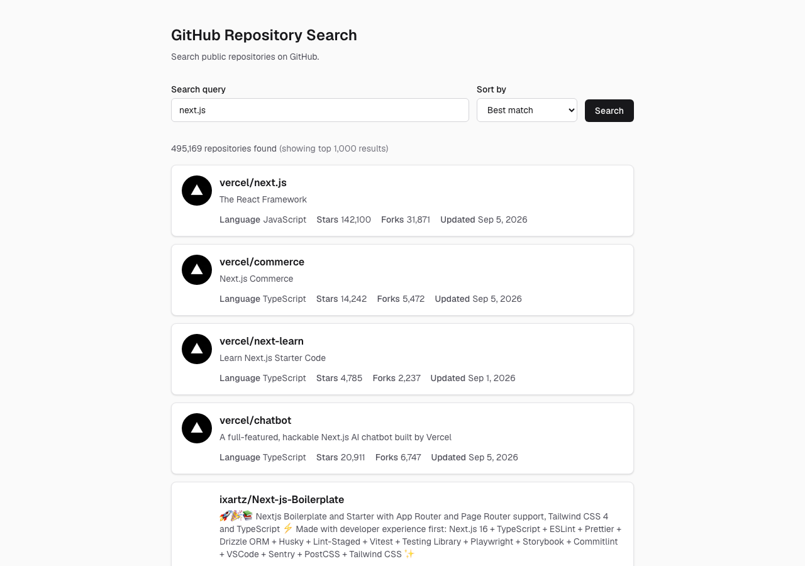

# GitHub Repository Search

[](https://github.com/okusawa/github-repository-search/actions/workflows/ci.yml)

GitHub の公開リポジトリをキーワード検索し、一覧と詳細をページとして表示する Web アプリケーションです。Next.js 16 App Router と React Server Components から GitHub REST API を呼び出します。検索条件は URL に持つので、リロード・共有・直リンクでも壊れません。

| 検索と一覧 | リポジトリ詳細 |
|---|---|
|  |  |

## 課題要件との対応

| # | 要件 | 実装 |
|---|------|------|
| E1 | Next.js v16 以降 | `next@16.3.4` |
| E2 | App Router | `src/app/` のみ |
| E3 | コンポーネントライブラリは任意 | 使わず Tailwind CSS のみ |
| R1 | キーワード入力 | 検索フォーム。`?q=` に反映 |
| R2 | `search/repositories` で一覧 | Server Component から直接呼び出し |
| R3 | 詳細に7項目 | 名前 / オーナーアイコン / 言語 / Star / Watcher / Fork / Issue |
| R4 | 詳細はページ | `/repositories/[owner]/[repo]` |
| R5 | テスト | Vitest 9 件、Playwright 2 件 |

## 起動方法

Node.js 22（`.nvmrc`）と npm が必要です。

```bash
nvm use
npm ci
cp .env.example .env.local   # 任意
npm run dev
```

http://localhost:3000

`GITHUB_TOKEN` は任意です。未設定でも動きます（Search API は 10 req/min）。トークンを置くと 30 req/min になります。public リポジトリの read だけの Fine-grained PAT で足ります。

```bash
docker build -t github-repository-search .
docker run -p 3000:3000 github-repository-search
```

トークンを使うときだけ `--env-file .env.local` を付けます。`docker-compose.yml` は置いていません。

| コマンド | 内容 |
|----------|------|
| `npm run lint` / `typecheck` / `test` | ESLint / `tsc` / Vitest |
| `npm run build` / `start` | 本番ビルドと起動 |
| `npm run test:e2e` | Playwright 2本。初回は `npx playwright install`。CI には含めない |

## 本番への載せ方

デプロイ先は課題に無いので載せていません。成果物は `output: 'standalone'` の Docker イメージで、ECS などコンテナ環境に渡せる形にしています。

- マルチステージ、non-root ユーザーで `node server.js`
- 秘密情報はビルドに焼かない（`.dockerignore` で `.env*` を除外）。`GITHUB_TOKEN` は実行時の環境変数
- デプロイ前の確認は GitHub Actions（lint / typecheck / test / `next build`）。`main` への push と PR の両方で走る
- 提出は一人なので作業は `main`。チームなら PR を必須にする

## 技術選定

| 技術 | 理由 |
|------|------|
| Next.js 16 App Router | 課題要件。`searchParams` を Server Component で受けられる |
| RSC | トークンと API 呼び出しをサーバーに閉じる |
| TypeScript（strict）+ zod | 型と、外部 API / クエリの実行時検証 |
| Tailwind CSS | この画面数なら追加の UI ライブラリは不要 |
| Vitest + MSW + Testing Library | ロジックと Client UI |
| Playwright | 通しとレート制限の E2E（2本） |

## 設計上の判断

### Watcher 数は `subscribers_count`

GitHub REST API では `watchers` / `watchers_count` / `stargazers_count` はいずれも **Star 数**です。課題が求める Watcher 数は **`subscribers_count`** で、一覧の `search/repositories` にはありません。詳細は `GET /repos/{owner}/{repo}` を呼び、直リンクでも成立させます。

> In responses from the REST API, `watchers`, `watchers_count`, and `stargazers_count` correspond to the number of users that have starred a repository, whereas `subscribers_count` corresponds to the number of watchers.
> — https://docs.github.com/en/rest/activity/starring

### Issue 数は `search/issues` を Suspense で分離

`open_issues_count` は Pull Request を含みます。Issue 数は `search/issues` で `type:issue state:open` を絞った `total_count` です。

Issue 数だけ Search API をもう1本呼びます。レート制限は詳細 API と別枠です（未認証 10 req/min）。他の項目をその応答待ちにしないため `<Suspense>` で流し、失敗は `IssueCount` で握って「Could not retrieve」にします。

### サーバー境界。Route Handler は作らない

| `'use client'` | 理由 |
|----------------|------|
| `search-form.tsx` | `router.push` で URL を組み立てる |
| `retry-button.tsx` | `router.refresh()` |
| 各 `error.tsx` | Next.js の error boundary は Client 必須 |

`pagination.tsx` は `<Link>` だけなので Server のままです。`GITHUB_TOKEN` に `NEXT_PUBLIC_` は付けません。検索状態は URL にあるので、`app/api/**` は挟んでいません。

### 検索状態は URL

検索条件は URL に持ち、`useState` は使いません。既定の `page=1` と `sort=best-match` はクエリに出さないので、1ページ目なら `/?q=next.js` だけになります。

### エラー分類

| 種別 | 判定 | 表示 |
|------|------|------|
| `rate_limit` | 403 / 429 かつ `x-ratelimit-remaining: 0` | 復帰までの相対時刻 |
| `not_found` | 404 | 詳細は `not-found.tsx` |
| `invalid_query` | 422 | 条件が不正 |
| `upstream` | 5xx とその他 4xx | GitHub 側の問題 |
| `network` | `fetch` が throw | 接続失敗 |

403 は権限エラーでも返るので、ヘッダを見ます。`'use cache'` 内でクラスを throw すると `error.tsx` に落ちるため、検索・詳細の API エラーは `kind` / `message` / `resetAt` のオブジェクトとして返します。詳細の 404 だけ `notFound()` します。

### キャッシュ

`cacheComponents: true` と、API 関数の `'use cache'` + `cacheLife('minutes')`。一覧は `<Suspense>` でストリーミングします。

## テスト戦略

| 層 | ツール | 対象 |
|----|--------|------|
| ユニット | Vitest | エラー分類、`searchParams` |
| データ層 | Vitest + MSW | `searchRepositories` のパースと zod |
| コンポーネント | Testing Library | 検索フォーム、ページネーション |
| E2E | Playwright | 検索→詳細、レート制限（2本） |

Server Component は Testing Library で描画していません。async のまま描画すると実際の画面とずれやすいので、通しは Playwright、ロジックは Vitest です。E2E は GitHub 本体を叩かず、`GITHUB_API_BASE` でローカルモックに向けます。CI には入れていません。Playwright のブラウザ準備で時間が伸びる一方、2本で得るものが小さいためです。

## AI の利用方法

| 役割 | 内容 |
|------|------|
| 設計判断（人間） | 仕様を先に固め、書いていない判断を実装にさせない |
| 調査（AI + 人間） | Watcher / Issue 数 / Cache Components。公式ドキュメントで裏取り |
| 実装（AI） | 確定した仕様に沿ったコード生成 |
| レビュー | 実装に使った AI とは別のモデルで読み、指摘を直した |
| 最終確認（人間） | コードと README の一致 |

伝えたいのは、使ったかどうかではなく、何を任せ何を任せなかったかです。

## スコープ外・制約・仮定

レート制限、トークン、エラー分類、CI、イメージは入れました。本格的な本番運用なら認証、監視、キャッシュ、国際化等の整備が必要ですが、今回は課題の範囲外と判断しました。Search API は先頭 1,000 件までしか返さないため、ページは最大 50 です。

| 仮定 | 解釈 |
|------|------|
| デプロイ URL | 必須ではない |
| 認証 | 不要 |
| ソート | best-match / stars / updated のみ |
| UI 言語 | 英語（データに合わせる） |
| ページネーション | 入れる（1,000 件上限に合わせる） |
